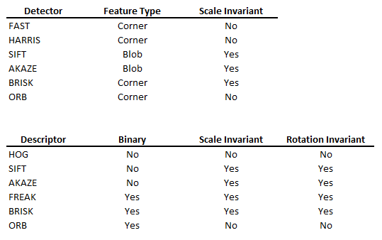

# SFND 3D Object Tracking - COMPLETED PROJECT

The goal of this project is to use Lidar and Camera data to estimate in a timed series of images and calculate the relative speed to the closest car in the front. After calculating the speed, time to collision with that car can be also calculated.

Lidar approach:
Using the Lidar data, closest distance to the car in the from is calculated. Sometimes a single closest point is not so reliable and some tricks need to be used for example to account for blooming or dust random pixels that can occuer.
One way to do this, is to select a closest point if there are other points in the tolerance of that point. Lidar may be in general more reliable for distance calculations that camera but it is more expensive and not always available.

Camera:
To calculate the distance of the car in the front, some geometrical calculations need to be done.
- Translating the co-ordinates of the points as measured by the camera to the defined co-ordinates of the car (that could be defined to be from Lidar sensor for example)
- Using YOLO to put bounding boxes around the objects of interest. [Link](https://towardsdatascience.com/yolo-you-only-look-once-real-time-object-detection-explained-492dc9230006) YOLO is available as a pre-trained deep NN in the openCV library.
- Between every two consecutiveframes the same points are extracted (General concept below) This makes it certain that between two frame the same shape or length changes dimensions in the 2D space of the camera. Using this information and the time that has passed between the two frames the change in the z- direction (direction of the car movement) can be calculated that can be directly translate to the relative speed.
- KeyPoint and KeyPoint descriptors extraction:
-- Keypoints are points that have special characteristics based on their neighbourhood. This makes them distinctive and make it possible to detect them repeatedly despite changes in image scaling, illumination noise, and orientation. The are several keypoint detection algorithms, some are based on gradient change in the area of a pixel (corners) some are based on blob detection, and there are techniques using deep NN. A simple comparison between most used techniques is shown below:
-- Descriptors record the neighboorhood characteristics of a keypoint. There are generally two approaches. History of gradient (HOG) and Binary descriptors. In binary descriptors the magnitude, direction of intensity, etc are encoded into a binary string and enables fast comparison of keypoints between images.
- Keypoints matching:
Using the keypoints and descriptors of two consecutive frames. Keypoints descriptors are compared and only the keypoints where their descriptors match are kept. Several filtering techniques are used to ensure higher reliability. Between all the matched keypoint pairs distances are calculated and averaged to estimate the change in the z- direction.

Codes completed in this project: FinalProject_Camera.cpp, camFusion_Student,cpp, dataStructures.h, lidarData.cpp, matching2D_Student.cpp
Detailed flow chat of all the steps that are implemented in these code files:

---
## References:
- https://www.cs.utah.edu/~srikumar/cv_spring2017_files/Keypoints&Descriptors.pdf
- http://bth.diva-portal.org/smash/get/diva2:1544922/FULLTEXT01.pdf

---
Local installation:

## Dependencies for Running Locally
* cmake >= 2.8
  * All OSes: [click here for installation instructions](https://cmake.org/install/)
* make >= 4.1 (Linux, Mac), 3.81 (Windows)
  * Linux: make is installed by default on most Linux distros
  * Mac: [install Xcode command line tools to get make](https://developer.apple.com/xcode/features/)
  * Windows: [Click here for installation instructions](http://gnuwin32.sourceforge.net/packages/make.htm)
* Git LFS
  * Weight files are handled using [LFS](https://git-lfs.github.com/)
  * Install Git LFS before cloning this Repo.
* OpenCV >= 4.1
  * This must be compiled from source using the `-D OPENCV_ENABLE_NONFREE=ON` cmake flag for testing the SIFT and SURF detectors.
  * The OpenCV 4.1.0 source code can be found [here](https://github.com/opencv/opencv/tree/4.1.0)
* gcc/g++ >= 5.4
  * Linux: gcc / g++ is installed by default on most Linux distros
  * Mac: same deal as make - [install Xcode command line tools](https://developer.apple.com/xcode/features/)
  * Windows: recommend using [MinGW](http://www.mingw.org/)

## Basic Build Instructions

1. Clone this repo.
2. Make a build directory in the top level project directory: `mkdir build && cd build`
3. Compile: `cmake .. 
4. Open in Visual Studio to compile

